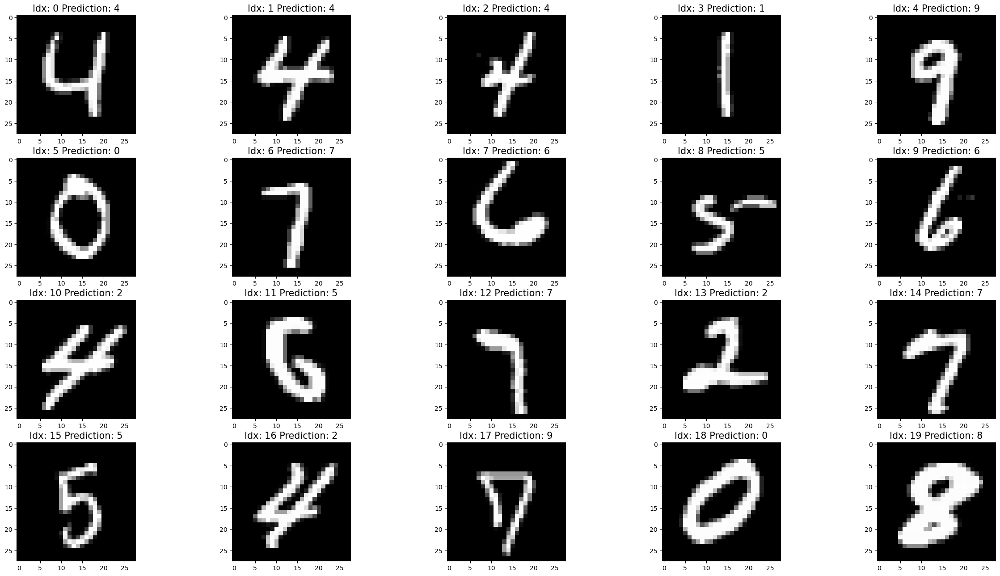

# Digit-classifier

### What is this project?
This is a neural network written with the basic mathematical functionalities of numpy to classify digits found in the MNIST database. The network is closely inspired by [the 3Blue1Brown videos on neural nets and deep learning](https://www.youtube.com/watch?v=aircAruvnKk&list=PLZHQObOWTQDNU6R1_67000Dx_ZCJB-3pi). 

### Results of project
The network currently has a **92.79%** prediction rate on the testing dataset. It has not been trained to its full extent, for example, I expect that with a bigger learning rate it could achieve a higher rate of correct predictions. I might experiment with this in the future, but for now this is where I shall leave it.

Above we can see some randomly selected test results with the image being labeled and the predicted digit written above it. Here we can see that the network has learned a few odd behaviors, for example, labeling the heavily skewed fours as twos. However, with most other digits, it performs well as expected by the prediction rate.

### Motivation for project

One and a half years ago, I became interested in the field of AI safety as a career option. After this, I went through and took notes on all the lessons of [AI Safety Fundamentals](https://course.aisafetyfundamentals.com/alignment) available on the Blue Dot Impact website. Since I was more keen on the coding side of this field I decided to get my feet wet with an elementary project such as this.

I was fascinated by the project 3Blue1Brown's videos described even around the time they came out, so I decided to tackle it as a first step. I also wanted to gain some more fundamental familiarity with neural networks. My final reason was to work with Python since most of my programming is done in C++. 

## How it works

The project contains two files, one is responsible for loading and handling the MNIST database, and the other is responsible for everything else related to creating and training the neural net. The following is a short overview of these files.

### MNIST-loader

This code is mostly lifted from the [link](https://www.kaggle.com/code/hojjatk/read-mnist-dataset/notebook) found on the top of the code blocks. I put it into a separate notebook since I only needed to run it to generate new batches for my training. 

There also exists a dataset folder in my local project where I keep the contents of the MNIST database in serialized form. These files can be generated by running this notebook. **WITHOUT GENERATING THESE FILES, NO TRAINING OR TESTING OF THE NETWORK IS POSSIBLE!**

### Digit-classifier

This notebook contains the code necessary for the network and its training/testing. Both the layers and weight matrices are defined with the help of numpy. The layers contain a lot of important data in a vector, such as:

- **Activation:** Self explanatory.
- **Bias:** Self explanatory.
- **Adj Bias:** This is a vector that accumulates all the changes we need to do the biases in the layer, and then after the backpropagation is finished for a batch, adds the values to the bias vector.
- **Z Vector:** This vector contains the value of A(ctivation) * W(eight) + B(ias). This is kept separate since this value can be reused after forward propagation when calculating the error for a given layer (by applying sigmoid' to Z and multiplying it with CGradient). The notation is based on the notation in the 3Blue1Brown video. 
- **Error:** Self explanatory.

The weight matrices also contain a second matrix named **Adj Matrix** similar in functionality to **Adj Bias**.

For training, we take a batch of n pairings of data and labels, run the forward and backward propagation on them, and finally adjust the weights and biases based on these results. The process of training is done with five functions: 

- **resetNetwork:** This function just resets the values in the layers into a neutral position, just in case. This includes resetting the Z Vector and the Error vector.
- **setStartLayerActivations:** This function simply sets the activations for the first layer based on the given example from the batch. It converts the values from the range of [0, 255] to [0, 1] and also checks if there is a length mismatch
- **fullForwardPropagation:** This function calculates the activations for each layer based on the sigmoid(A * W + B) function. This is done in two steps to preserve the value of A * W + B in Z for the future.
- **fullBackwardPropagation:** This function calculates all the errors in each layer. For the final layer, a special function is used, and for the rest, there exists a "generic" function.
- **adjustBasedOnGradientDescentForCurrentExample:** This function determines what values should be added to the **Adj Bias** and **Adj Matrix** vectors and matrices based on the matching error and an **npm** value, which is the learning rate divided by the number of elements in the current batch. These "Adj" variables will be subtracted from their matching counterparts after the above described process is finished for all elements in the batch.

All the testing and training utilizes the above functions in different configurations. 

The final code block in the file contains the code for loading the training and testing data, and then based on the **testing** and **training** variables. When one of them is true, the corresponding functionality happens.

The notebooks contain further comments for further explanation of all the functionalities included in them. 